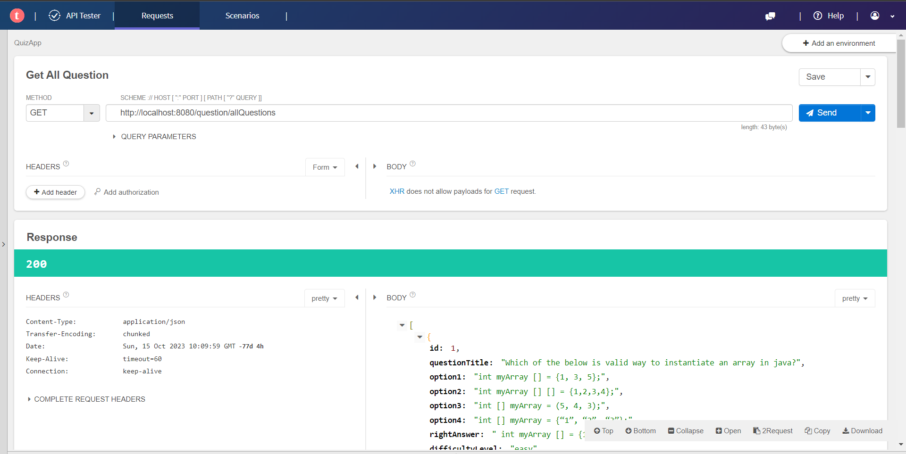

# Quiz Web Application Documentation



## Overview

This Quiz Web Application is a backend-focused project developed using Java, Spring Boot, Spring JPA, and MySQL. The application provides a set of APIs to manage quiz questions, allowing users to interact with the system for functionalities such as retrieving questions, adding new questions, and deleting questions.

## Technologies Used nothing

- Java
- Spring Boot
- Spring Data JPA
- MySQL Database
- Spring Web
- Lombok
- Spring Devtools
- MySQL Connector J

## Setting Up the Project

1. **Spring Initializer:**
   - Create a Spring Boot project using the [Spring Initializer](https://start.spring.io/).
   - Add dependencies: Spring Web, Spring Data JPA, MySQL Connector J, Spring Devtools, Lombok.

2. **Database Configuration:**
   - Configure MySQL database connection in the `application.properties` file.

## API Endpoints

### 1. Get All Questions

**Endpoint:** `GET /question/allQuestions`

**Description:**
Retrieves all quiz questions from the database.

### 2. Get Questions by Category (Java)

**Endpoint:** `GET /question/category/Java`

**Description:**
Retrieves quiz questions categorized under "Java."

### 3. Get Questions by Category (Python)

**Endpoint:** `GET /question/category/Python`

**Description:**
Retrieves quiz questions categorized under "Python."

### 4. Delete Question by ID

**Endpoint:** `DELETE /question/deleteQuestion/{questionId}`

**Description:**
Deletes a quiz question based on the provided question ID.

### 5. Add Question

**Endpoint:** `POST /question/addQuestion`

**Description:**
Adds a new quiz question to the database. Requires JSON payload with question details.

### 6. Get Questions for Users

**Endpoint:** `GET /question/userQuestions`

**Description:**
Retrieves quiz questions tailored for a specific user, based on their preferences or previous interactions.

## How it Works

1. **Database Structure:**
   - The application uses Spring JPA to interact with the MySQL database, storing quiz questions.

2. **API Functionality:**
   - Users can call the provided API endpoints to perform various actions on quiz questions.

3. **Testing Example:**
   - Example requests for testing: (Use Talend API Tester or Postman to test the API endpoints based on the provided examples.)
     - Get All Questions: `GET http://localhost:8080/question/allQuestions`
     - Get Java Questions: `GET http://localhost:8080/question/category/Java`
     - Get Python Questions: `GET http://localhost:8080/question/category/Python`
     - Delete Question: `DELETE http://localhost:8080/question/deleteQuestion/10`
     - Add Question: `POST http://localhost:8080/question/addQuestion` (with JSON payload)

## Conclusion

This Quiz Web Application backend is designed for flexibility and ease of use, providing a robust set of APIs for managing quiz questions. Feel free to explore the GitHub repository for more details.

Feel free to reach out for any questions or suggestions. Happy coding! 🚀


```SQL
/*SQL Query to create database and table to store questions*/

create database quizdb;

use quizdb;

create table question(
id INT AUTO_INCREMENT PRIMARY KEY,
question_title VARCHAR(500),
option1 varchar(150),
option2 varchar(150),
option3 varchar(150),
option4 varchar(150),
right_answer varchar(150),
difficulty_level varchar(20));


ALTER TABLE quizdb.question
ADD category varchar(20);
